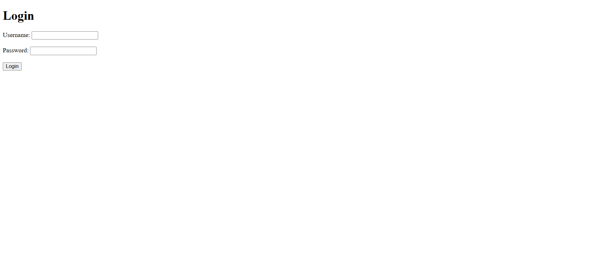
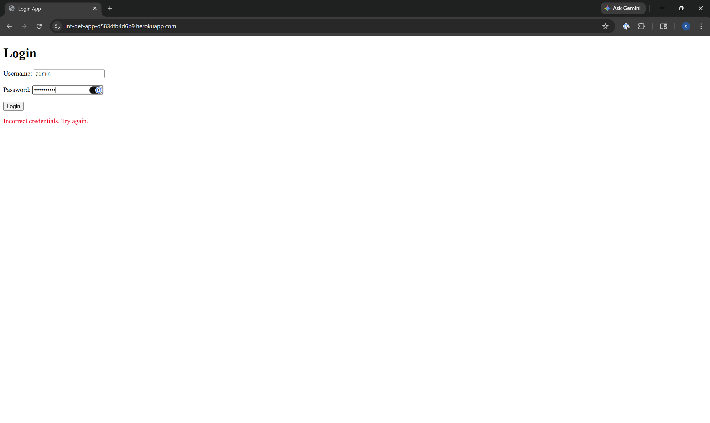
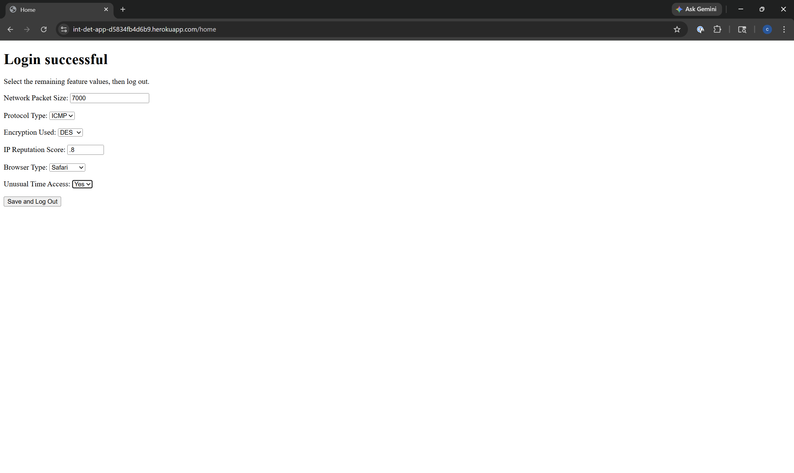
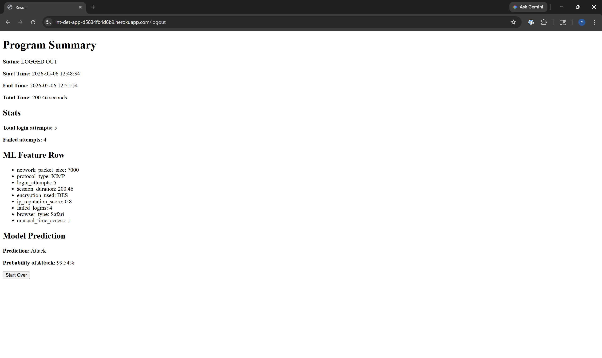
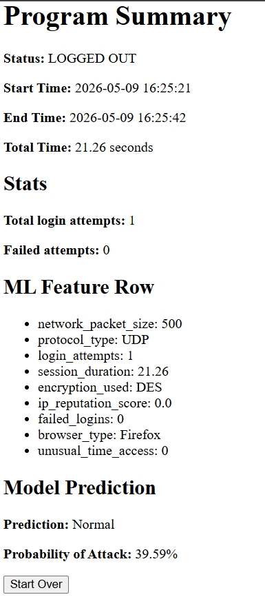
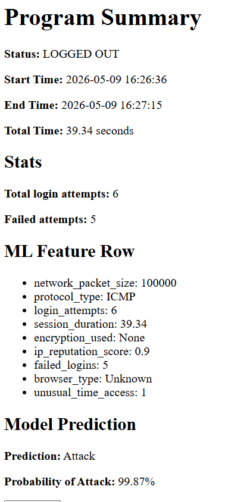

# intrusion-detection-ml
Python Machine Learning final repo

## Our Model
- We set out to make a machine learning model that given some input can tell whether the user behavior is normal or malicious.
- Our model was trained on this intrusion detection dataset from kaggle: https://www.kaggle.com/datasets/dnkumars/cybersecurity-intrusion-detection-dataset/data
    - We had some issues with the dataset in that some of the total logins were greater than the failed logins which we show in our notebook.

## **START** Method

### S - Situation

Cybersecurity systems often need to recognize suspicious activity quickly. Network sessions can contain patterns that may indicate an attack, such as repeated failed logins, unusual access times, suspicious IP reputation scores, or unusual protocol/encryption combinations.

### T - Task

The task was to build a machine learning model that predicts whether a network session is **Normal** or an **Attack**. Then deploy the final model to a web app.

### A - Action

We loaded and explored a cybersecurity intrusion detection dataset, checked for missing or duplicate data, performed exploratory data analysis, and created visualizations to understand patterns in the target label. We also investigated a data quality issue where some rows had `failed_logins` greater than `login_attempts`.

For modeling, we used a scikit-learn preprocessing pipeline with:

- `StandardScaler` for numeric features
- `OneHotEncoder` for categorical features
- Stratified train/test splitting
- Cross-validation for model comparison

We compared several models, including:

- **Logistic Regression (Baseline Model)**
- **Random Forest**
- **Extra Trees**
- **Gradient Boosting**
- **HistGradientBoosting**
- **XGBoost**

The final model was saved with `joblib` and used inside a Flask demo application.

### R - Result

The final selected model was **GradientBoosting**.

On the final test set, the model achieved approximately:

| Metric | Score |
|---|---:|
| Accuracy | 0.903 |
| Precision | 1.000 |
| Recall | 0.783 |
| F1 Score | 0.878 |
| F2 Score | 0.819 |
| ROC AUC | 0.894 |
| Average Precision | 0.921 |

The model was very precise when predicting attacks, meaning that when it labeled a session as an attack, it was usually correct. However, recall was lower than precision, meaning some attacks were still missed. Since cybersecurity often cares about catching attacks, recall and F2 score were important metrics in our evaluation.

### T - Takeaway

This project helped us practice the full machine learning workflow from data exploration to deployment. We learned that model performance is not just about accuracy but about the tradeoff between catching attacks and creating false alarms, which matters a lot in cybersecurity. We also learned how to package a trained model into a Flask app so that the model can be used outside of a notebook and make predictions with given data.

---

## How to Run the Notebook

The easiest way to run the notebook is with **Conda**. Docker files are included for the application environment, but this _how to run_ will focus on using **Conda**.

### 1. Clone the repository

```bash
git clone https://github.com/Pdmurphy2/intrusion-detection-ml.git
cd intrusion-detection-ml
```

### 2. Create and activate a Conda environment

```bash
conda create -n intrusion-ml python=3.11 -y
conda activate intrusion-ml
```

### 3. Install notebook dependencies from `requirements.txt`:

```bash
pip install -r requirements.txt
```

### 4. Register the environment as a Jupyter kernel

```bash
python -m ipykernel install --user --name intrusion-ml --display-name "Python (intrusion-ml)"
```

### 5. Launch Jupyter Lab

```bash
jupyter lab
```

Open:

```text
final_model/showcase.ipynb
```

Then select the kernel:

```text
Python (intrusion-ml)
```

Run the notebook from top to bottom.

---

## How to Run the Flask Web App

The repository also includes a small Flask web application demo that uses the trained intrusion detection model. This app is intended as a simple demo interface for testing the final trained model outside of the notebook.

Before running the app, make sure the Conda environment has already been created and activated:

```bash
conda activate intrusion-ml
```

From the root project folder, move into the web app directory:

```bash
cd web_app
```

Run the Flask application:

```bash
python app.py
```

Once the app starts, open the local URL shown in the terminal. It will should be:

```text
http://127.0.0.1:5000
```

Once you're done using the app then you can `Ctrl + c` to end it in the terminal


## Our Running App
You can take a look at our app and how it functions in the running_app folder and see screenshots of it running. 

- First is the login screen where it starts the timer and tracks your failed and total logins.
- After you login with username: admin and password: password123 you can enter in values that correlate with our features.
    - ip_reputation values closer to 0 are considered normal and closer to 1 are considered attacks.
    - network_packet_size in between 70 and 6000 are considered normal behavior and outside of that are suspicious.
    - our model also relies heavily on faild_logins and login_attempts the higher they are the more likely to be attacks.
    - unusual_time_access value 1 is true so it is not normal business hours and 0 is false meaning it is normal business hours.
- The last screen is the summary showing the values you entered and whether our model predicts what you entered as an attack or not.

Here is the app running at the login screen:



Here is the app when you `"Fail"` to login:



To login you use the credentials:
- Username: **admin**
- Password: **password123**

Which will then take you to this screen where you enter data for the model as described in the `Our Running App` section:



The after you `Save and Log Out` you will then reach a summary page that gives you data on the session and the Model's prediction with attack probability:



Here is an example of a `Normal` summary:



And an example of an `Attack`:



## Future Improvements

Possible future improvements include:

- Test the model on additional intrusion detection datasets
- Tune thresholds based on the cost of false positives and false negatives
- Compare against additional models or deep learning approaches
- Add user input validation to the Flask app
- Improve the deployed app interface

---

## Locations
- Our finalized model is in the final_model folder.
- anything to do with the application is in the web_app folder.
    - screenshots of the running application is in the running_app folder inside of web_app.
- The judges evaluations and our self evaluations are inside of the evaluations folder. 